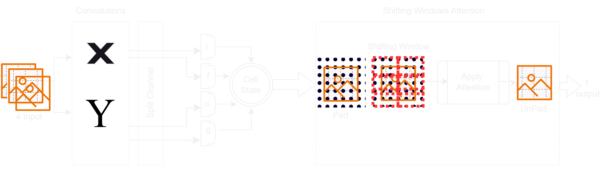
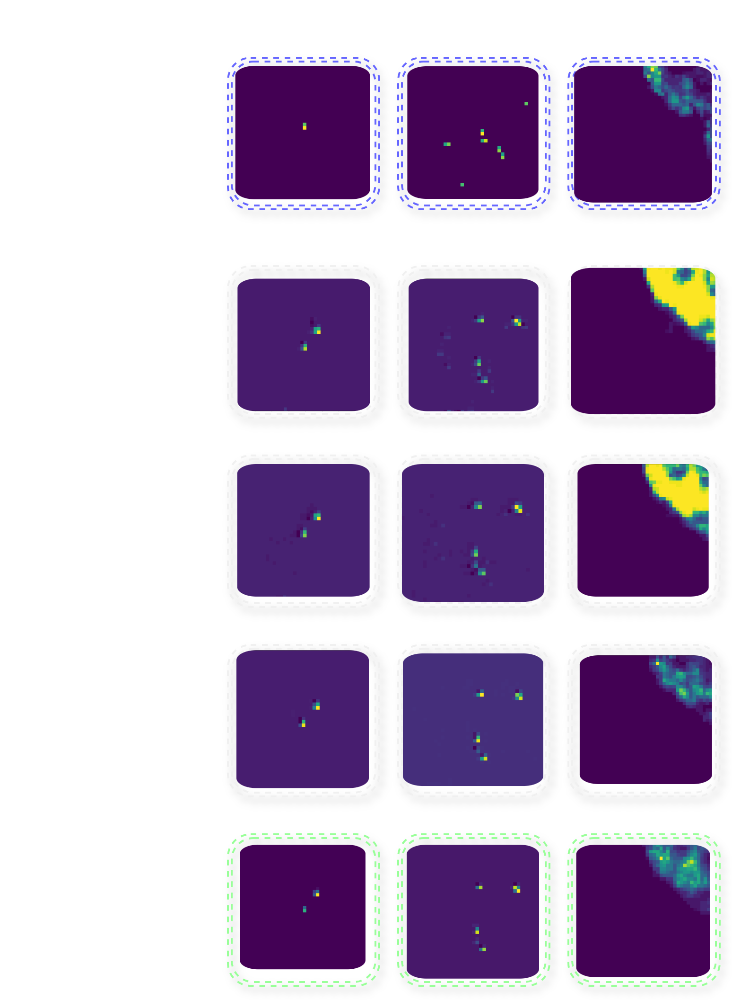
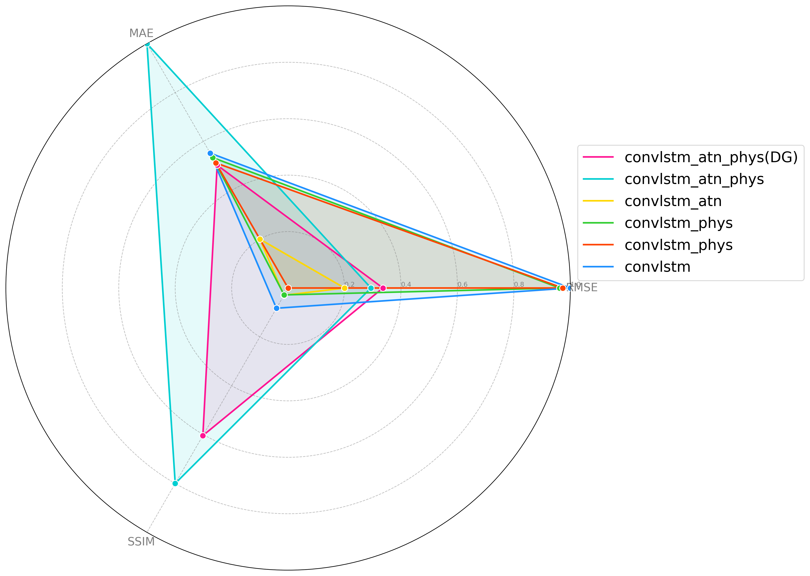
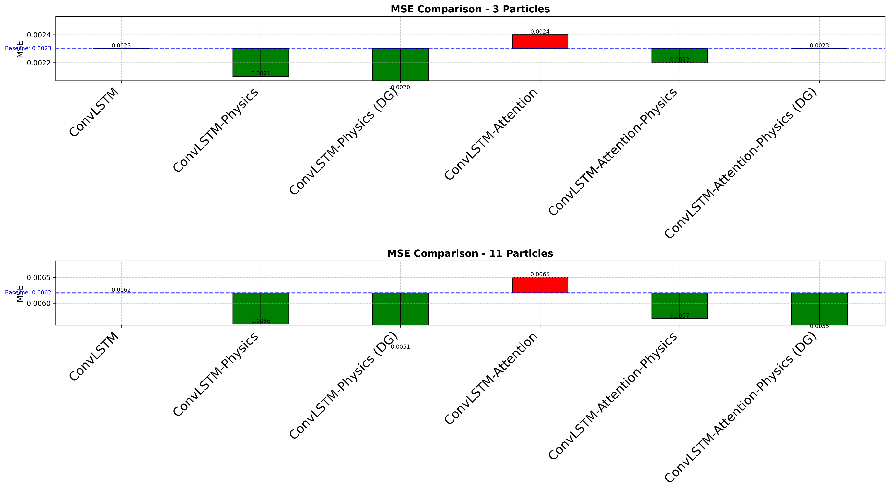
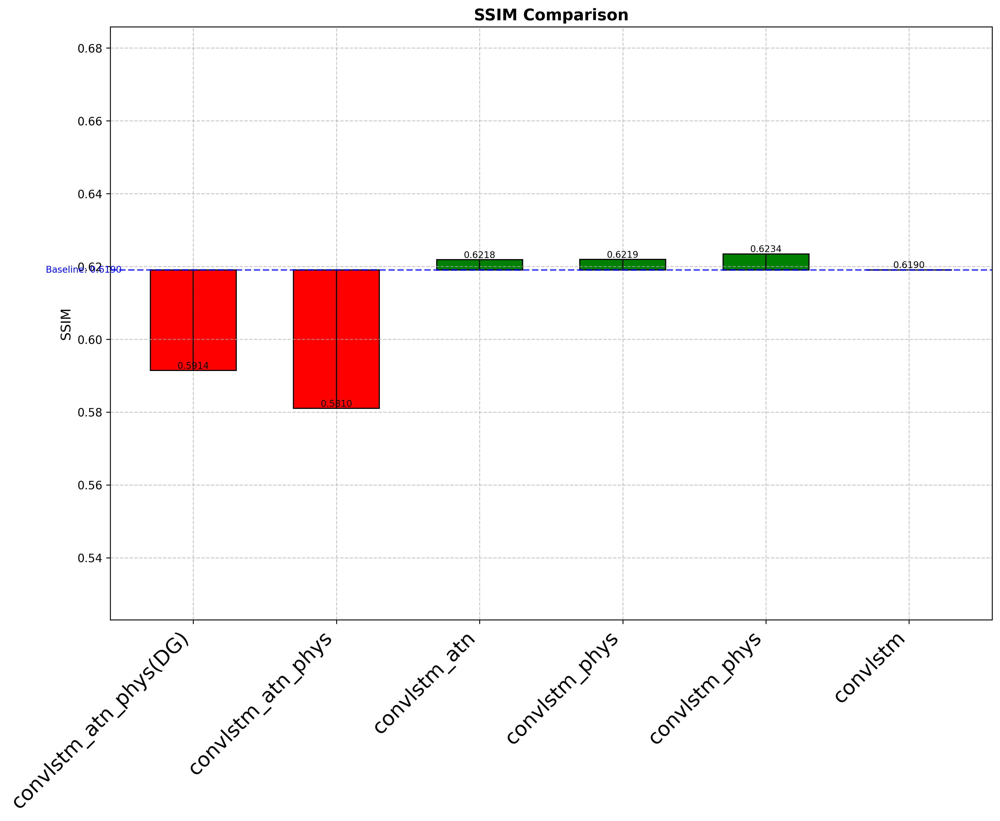

# Regularized Radar Extrapolation: Combining Advection Physics with Attention-ConvLSTM for Robust Nowcasting

## Overview

This project addresses the challenge of radar-based precipitation nowcasting by integrating physical laws with advanced machine learning techniques. We propose a novel approach that combines Convolutional Long Short-Term Memory (ConvLSTM) networks with physics-informed regularization and attention mechanisms to improve the accuracy and reliability of short-term weather predictions.

## Getting Started

- Create a conda or python virtual environment
- Install the requirements

```
pip install -r requirements.txt

```
- Run the train and eval scripts to train the models and evaluate their performance.
```
/path/to/python/venv or conda -m  src.train_eval --config /path/to/config.ini
```
- Add dataset and model paths to the config dictionary of train_eval script and Train_eval_manager script.
- Dataset can be generated from synthetic data by running tests/synthetic_data_test.py and radar movie is available via git lfs
```
src.datasets/*.npy
```
- The dataset for extrapolation testing can be generated via the api example in src.tests.synthetic_data_test

## Architecture 

Our model architecture consists of four main variants:

1. Standard ConvLSTM (baseline)
2. Physics-informed ConvLSTM (ConvLSTM-Physics)
3. Attention-based ConvLSTM (ConvLSTM-Attention)
4. Physics-informed Attention-based ConvLSTM (ConvLSTM-Attention-Physics)



The architecture diagram above illustrates the key components of our model, including the ConvLSTM layers, attention mechanisms, and physics-informed regularization.

## Key Features

- Integration of 2D advection equation as a regularization term
- Dynamic grid mechanism for handling ill-posed configurations
- Synthetic data generation for model training and evaluation
- Extrapolation analysis to assess model generalization
- Robust nowcasting experiments using real radar reflectivity data

## Results

Our experiments demonstrate the effectiveness of incorporating physics-informed regularization and attention mechanisms in radar nowcasting tasks.

### Extrapolation Analysis

The table below shows the performance of our models in extrapolating from single-particle to multi-particle scenarios:

| Model | 3 Particles (MSE) | 3 Particles (MAE) | 11 Particles (MSE) | 11 Particles (MAE) |
|-------|-------------------|-------------------|---------------------|---------------------|
| ConvLSTM | 0.0023 | 8.4720 | 0.0062 | 21.8797 |
| ConvLSTM-Physics | 0.0021 | 7.9750 | 0.0056 | 21.1488 |
| ConvLSTM-Physics (Dynamic Grid) | 0.0020 | 7.1409 | 0.0051 | 19.2754 |
| ConvLSTM-Attention | 0.0024 | 6.9694 | 0.0065 | 19.1884 |
| ConvLSTM-Attention-Physics | 0.0022 | 6.9971 | 0.0057 | 16.7913 |
| ConvLSTM-Attention-Physics (Dynamic Grid) | 0.0023 | 6.6932 | 0.0055 | 16.0350 |

### Robust Nowcasting

The following table presents the performance of our models on real radar reflectivity data:

| Model | MSE | MAE |
|-------|-----|-----|
| ConvLSTM (Standard) | 941.0779 | 13039.1438 |
| ConvLSTM (Physics-Informed) | 940.7903 | 12701.3924 |
| ConvLSTM (Physics-Informed + Dynamic Grid) | 935.9675 | 13032.8909 |
| ConvLSTM-Attention (Standard) | 847.1528 | 12867.7427 |
| ConvLSTM-Attention (Physics-Informed) | 840.4709 | 12337.6249 |
| ConvLSTM-Attention (Physics-Informed + Dynamic Grid) | 999.1830 | 17771.2780 |


The image above provides a visual comparison of the dynamic grid results for different model variants.

The image above provides a visual comparison of the radar movie results for different model variants.

The image above provides a visual comparison of the RMSE results for different model variants.



## Conclusion

Our research demonstrates that incorporating physics-informed regularization and attention mechanisms significantly improves the accuracy and reliability of radar-based precipitation nowcasting. The proposed models show enhanced performance in both extrapolation tasks and real-world nowcasting scenarios. This demonstrates the potential of combining data-driven approaches with physical insights in weather prediction.

